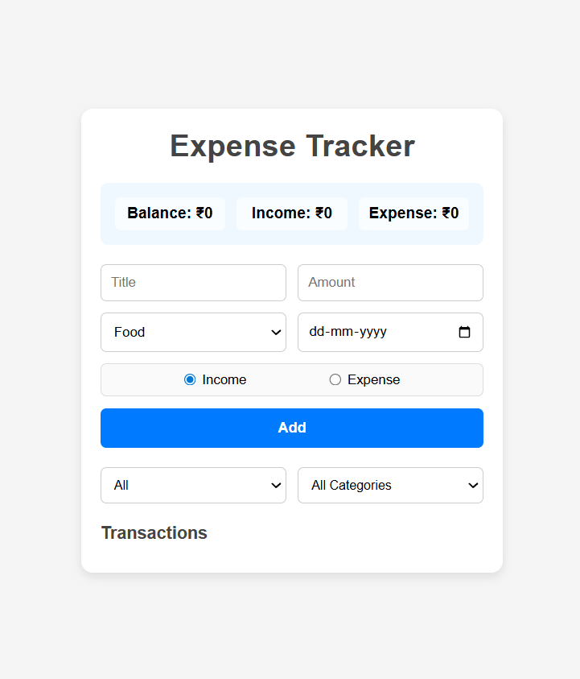

# expense-tracker
Track your income and expenses effortlessly with this responsive web app.

# Expense Tracker

A simple and responsive **Expense Tracker** web app to manage your income and expenses.

---

## Features

- Add transactions with **title**, **amount**, **category**, **date**, and **type** (Income/Expense).  
- Dynamic calculation of **Balance**, **Total Income**, and **Total Expense**.  
- Filter transactions by **Type** (Income/Expense/All) and **Category**.  
- Delete transactions easily.  
- Fully **responsive design** for mobile and desktop.

---

## Screenshot

  
*(Add a screenshot here if available)*

---

## Installation

1. Clone the repository:

```bash
git clone https://github.com/Palak-Dwivedi20/expense-tracker.git


2. Open index.html in your browser.

Usage

Fill the transaction form.

Click Add to save it.

Use filters to view transactions by type or category.

Click Delete to remove a transaction.

Technologies Used

HTML5
CSS3
JavaScript (Vanilla JS)


made by 
Palak Dwivedi.